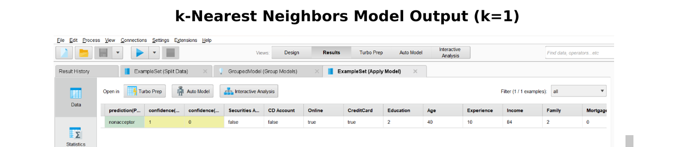
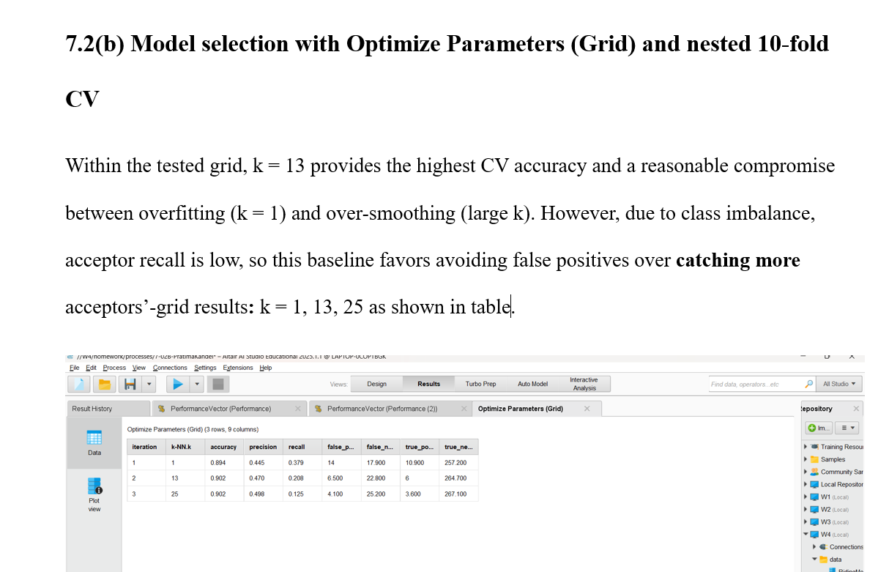
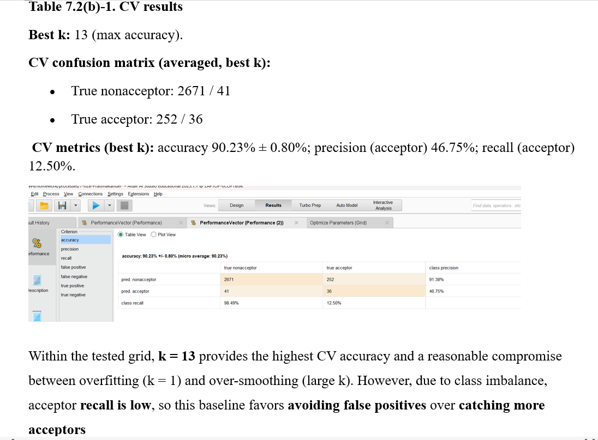
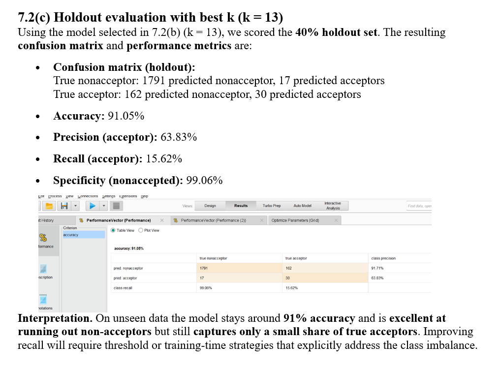

# 🤖 Personal Loan Acceptance Prediction

Machine learning classification model using **k-Nearest Neighbors (k=13)** achieving **91.05% accuracy** in predicting customer loan acceptance behavior.

## 📊 Model Architecture

## 🎯 Project Overview

Built a predictive model to help banks:
- Identify likely loan acceptors
- Reduce marketing costs
- Improve campaign targeting
- Optimize sales strategies

## 🔬 Methodology

### Step 1: k-NN Classification with k=1 baseline
- Initial classification model
- Single nearest neighbor approach
- Baseline performance evaluation

### Step 2: Grid Search Optimization

- Tested k values: 1, 13, 25
- 10-fold nested cross-validation
- Best k = 13 (max accuracy)

### Step 3: Cross-Validation Results

| Metric | Value |
|--------|-------|
| **CV Accuracy** | 90.23% ± 0.80% |
| **Precision** | 46.75% |
| **Recall** | 12.50% |
| **Class Precision (Non-acceptor)** | 91.38% |

### Step 4: Holdout Evaluation (40% test set)

| Metric | Value |
|--------|-------|
| **Accuracy** | **91.05%** ⭐ |
| **Precision (acceptor)** | 63.83% |
| **Recall (acceptor)** | 15.62% |
| **Specificity (non-acceptor)** | 99.06% |

## 🔍 Key Findings

- Model achieves **91% accuracy** on unseen data
- **Excellent** at identifying non-acceptors (99.06% specificity)
- Class imbalance affects recall for acceptors
- Strong baseline for loan targeting strategies

## 🛠️ Tools & Technologies

- **RapidMiner Studio** — ML platform
- **k-Nearest Neighbors (k-NN)** — Classification algorithm
- **Grid Search** — Hyperparameter optimization
- **10-Fold Cross-Validation** — Model validation
- **Confusion Matrix** — Performance evaluation

## 💡 Business Recommendations

1. **Deploy model** for initial loan screening
2. **Address class imbalance** with SMOTE or threshold tuning
3. **Combine with rule-based filters** for higher recall
4. **Re-train quarterly** with new customer data

## 👩‍💻 Author

**Pratima Kandel**  
🎓 Business Analytics Graduate Student | Webster University  
📍 St. Louis, MO

---

⭐ *If you found this project helpful, please give it a star!*
